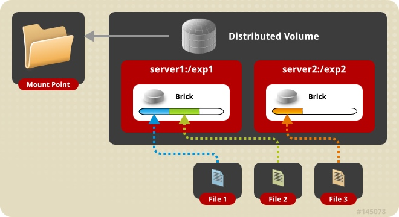
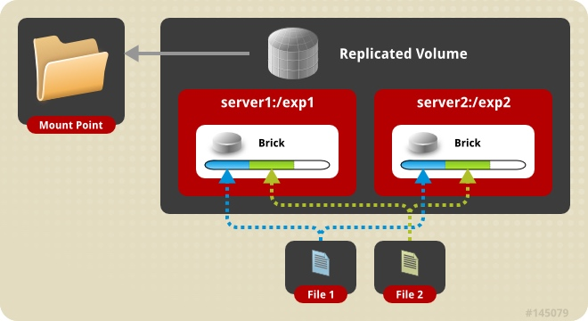
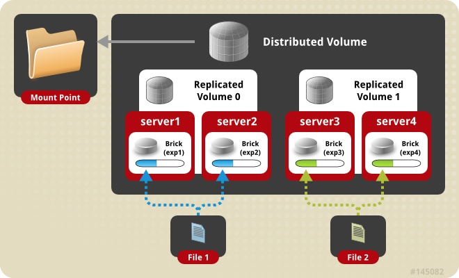
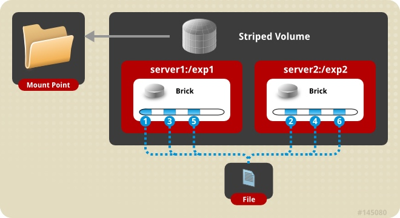
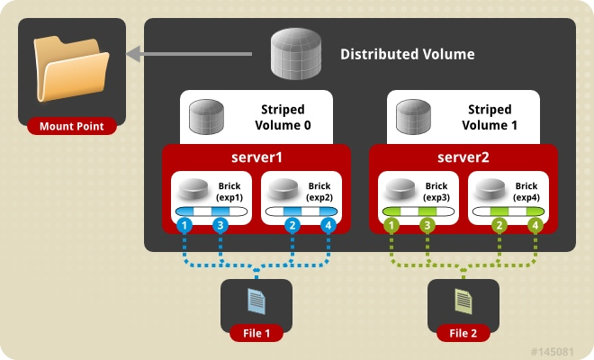
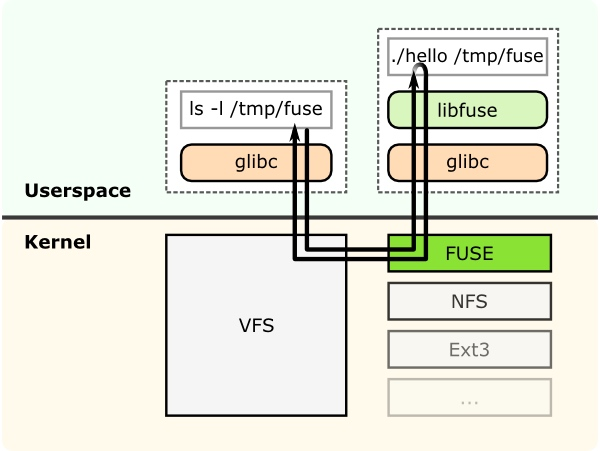
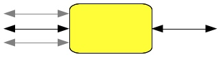

# 架构
## Volumes的种类
Volume是brick的集合，并且GlusterFS的大多数操作都发生在其上。Glusterfs文件系统根据需要支持不同种类的的volume。一些volume利于扩展存储空间，一些利于提高性能，一些有利于两者。

1. 分布式GlusterFS Volume - 这是默认的GlusterFS volume。如果你在创建volume的时候不指定volume的具体类型的话，默认的选择是创建一个分布式的volume。这里，文件在分布式的volume中的brick中的。所以file1 可能存储在brick1和brick2，但是不会同时在两者上。因为这里没有数据冗余。这种存储volume的目的是为了简单便宜的扩展volume的大小。然而，这也意味着一个brick的失败会导致完全失去数据，因此，必须依赖于潜在的硬件对数据丢失的保护。
	
	分布式volume
	创建一个分布式volume
	gluster volume create NEW-VOLNAME [transport [tcp | rdma | tcp,rdma]] NEW-BRICK...
	例如：创建一个分布式volume拥有四个存储服务器使用tcp。
	
	```c
	gluster volume create test-volume server1:/exp1 server2:/exp2 server3:/exp3 server4:/exp4
	Creation of test-volume has been successful
	Please start the volume to access data
	```
	
	为了显示volume的信息：
	
	```c
	#gluster volume info
Volume Name: test-volume
Type: Distribute
Status: Created
Number of Bricks: 4
Transport-type: tcp
Bricks:
Brick1: server1:/exp1
Brick2: server2:/exp2
Brick3: server3:/exp3
Brick4: server4:/exp4
	```
2. 复制GlusterFS volume - 在这中Volume中，我们克服了在分布式Volume中面临的数据丢失问题。这里其实是拷贝了所有在brick上存储的数据。所以我们至少需要创建一个拥有两个brick的Volume或者拥有三个重复brick的Volume。这种Volume的的一个主要好处是当一个brick挂掉了，其他的brick还同样能够访问。这种Volume有着更好的数据可靠性和冗余性。
	
replicated volume
创建一个replicated Volume

命令如下：
gluster volume create NEW-VOLNAME [replica COUNT] [transport [tcp | rdma | tcp,rdma]] NEW-BRICK...

例如：为了创建一个拥有两个存储服务器的replicated volume:

```c
# gluster volume create test-volume replica 2 transport tcp server1:/exp1 server2:/exp2
Creation of test-volume has been successful
Please start the volume to access data
```

3. Distributed Replicated Glusterfs Volume - 在这种Volume中，文件是被分布存储在一些brick中。brick的数目要是replica的数目的倍数。同时，我们制定的brick的顺序也是有关系的，相邻的brick成为互相的replica。这种Volume被使用在需要高可用和数据冗余和扩展存储量的情况下。因此当有8个brick的情况下，replica有两个，那么两两成为replica。这种Volume有4x2个。
	
Distributed Replicated volume

创建Distributed Replicated volume：

	# gluster volume create NEW-VOLNAME [replica COUNT] [transport [tcp | rdma | tcp,rdma]] NEW-BRICK...
	
例如：四个节点，拥有双向镜像：

```c
# gluster volume create test-volume replica 2 transport tcp server1:/exp1 server2:/exp2 server3:/exp3 server4:/exp4
Creation of test-volume has been successful
Please start the volume to access data
```

4.Striped Glusterfs Volume 考虑一个大文件要被存储在一个brick看里，且频繁的被多个客户端同时访问。这会导致一个brick同时有太多的负载，这会影响性能。在Striped Glusterfs Volume中，数据被划分成不同的段存储在不同的brick中。所以大文件被划分成小的部分。现在负载被均分了，并且能够很快的取回数据了，但是没有数据冗余了。

striped volume

创造一个striped Volume

```c
gluster volume create NEW-VOLNAME [stripe COUNT] [transport [tcp | dma | tcp,rdma]] NEW-BRICK...
```

例如，为了建立一个扩月两个服务器的striped volum：

```c
# gluster volume create test-volume stripe 2 transport tcp server1:/exp1 server2:/exp2
Creation of test-volume has been successful
Please start the volume to access data
```

5.Distributed Striped Glusterfs Volume - 这和Striped Volume有点像striped glusterfs volume ,除了stripes在这里能够被分布在比brick数量更多的brick上。然而这个数量一定要是strips的整数倍。因此我们能增长这个Volume的数量，因此我们必须以strip的整数倍增加brick。

Distributed Striped volume

创建一个分布式的striped volume：
gluster volume create NEW-VOLNAME [stripe COUNT] [transport [tcp | rdma | tcp,rdma]] NEW-BRICK...
例如：为了创造一个在八个服务器上的striped volume：

```c
# gluster volume create test-volume stripe 4 transport tcp
 server1:/exp1 server2:/exp2 server3:/exp3 server4:/exp4 server5:/exp5 server6:/exp6 server7:/exp7 server8:/exp8
Creation of test-volume has been successful
Please start the volume to access data.
```

# FUSE
GluseterFs是一个用户空间文件系统。这是由GlusterFS 开发者最开始就做出的决定，因为从linux内核获得这个模块是一个非常长而且困难的过程。

作为一个用户空间文件系统，为了与内核VFS进行交互，GLusterFS充分利用FUSE。在一个很长的时间里，事项一个用户空间文件系统被认为是不可能的。FUSE被开发出来解决这个问题。FUSE是一个内核模块，支持内核VFS与非特权用户应用之间的交互，它提供了API，这些API能从用户空间使用。使用这些API，任何的文件系统都能够被用任何语言实现，因为许多语言与FUSE之间都有绑定。

FUSE的结构表

这张表显示了一个文件系统“hello world” ,这个hello world被编译成一个二进制文件hello。它被一个文件系统挂载在/tmp/fuse 来执行。然后用户使用 ls -l这个命令在/tmp/fuse。这个命令通过glbc到达VFS并且因为挂载/tmp/fuse管理到一个FUSE，因此，VFS将这个命令传给FUSE模块。这个FUSE内核模块，得到真正的文件系统二进制hello，并且将其传给glibc和用户控件的FUSE库。结果通过同样的路径返回。

这个交互是在FUSE内核和FUSE库中通过一个特殊的文件描述符来完成的，这个就是/dev/fuse.这个文件能够被打开很多次，并且是通过传给挂载系统调用来获得的，匹配挂载的文件系统。

# Translators
##翻译“translators”：

* 一个translator将用户的请求转换成存储的请求
* 	*一个对一个，一个对多个，一个对0个（例如：缓存）
  
* 一个translator能通过这些方式改变请求：
	将一个请求类型转换成另一个请求类型（通过translator将request转换）改变路径，flags，甚至是数据（比如加密）
* translator能解释或者阻塞请求。（例如：权限控制）
* 或者产生新的请求

##translator怎么工作：
* 共享对象
* 通过‘volfile’动态加载
	dlopen/dlsync 设置指针指向parents/children调用init（构造）调用io函数通过fops。
* 转换生效或者扔掉等
* 对于translator的配置是通过命令行来配置的，所以你不必知道通过怎样的顺序来组织translator。

## translator的类型
下面的列表是已知的当前状态的translator。

translator类型 | 功能目的
--------- | -------------
Storage | 最底层的translator，从本地文件系统存储和访问数据
Debug | 提供错误和debug的统计数据
Cluster | 处理分发和复制数据，因为这关系到从brick和node读写数据
Encryption | 额外的translator为了及时的对存储数据加解密


	


